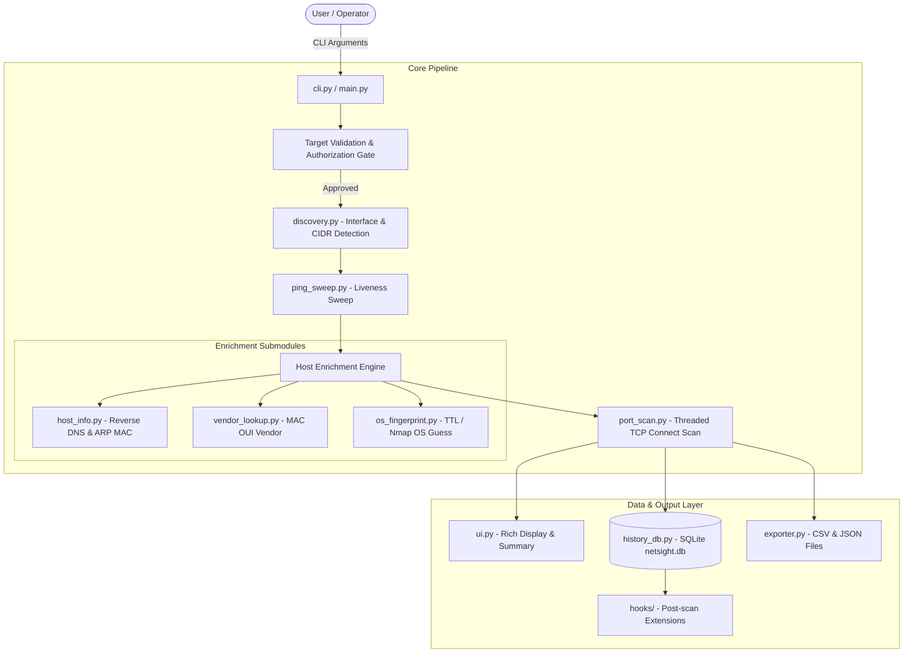
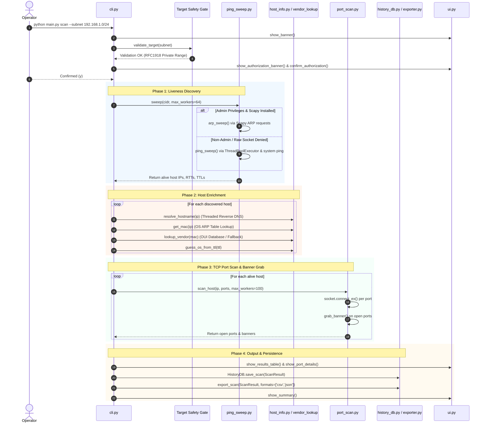
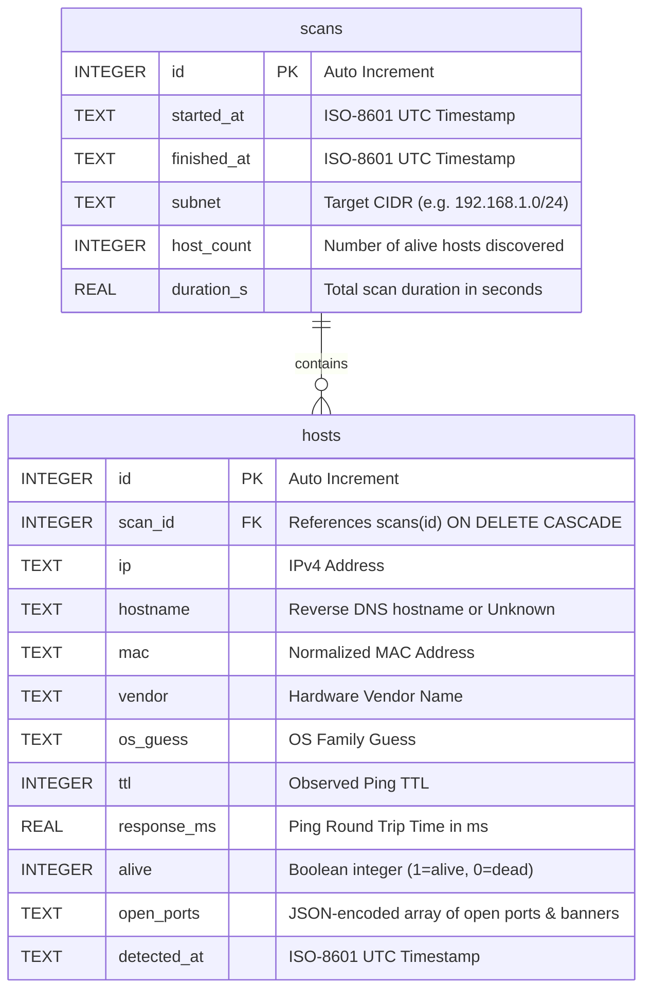

# NetSight — Architecture, System Workflow & Usage Guide

Welcome to the comprehensive architecture and workflow documentation for **NetSight**, an enterprise-styled, safety-first network discovery and device scanner built in Python 3.12+.

## Table of Contents

- [1. Project Overview](#1-project-overview)
  - [Key Characteristics & Safety Design](#key-characteristics--safety-design)
- [2. File & Code Structure Breakdown](#2-file--code-structure-breakdown)
  - [Detailed Component Summary](#detailed-component-summary)
- [3. High-Level Architecture & System Workflow](#3-high-level-architecture--system-workflow)
  - [3.1 System Architecture Diagram](#31-system-architecture-diagram)
  - [3.2 End-to-End Scan Execution Flow](#32-end-to-end-scan-execution-flow)
- [4. SQLite Database Schema (`netsight.db`)](#4-sqlite-database-schema-netsightdb)
- [5. Practical Daily Life Use Cases](#5-practical-daily-life-use-cases)
- [6. How to Setup and Run NetSight](#6-how-to-setup-and-run-netsight)
  - [6.1 Prerequisites](#61-prerequisites)
  - [6.2 Installation Steps](#62-installation-steps)
  - [6.3 Command Execution Reference](#63-command-execution-reference)
  - [6.4 Running Automated Unit Tests](#64-running-automated-unit-tests)
- [7. Extension Points (v1.1+)](#7-extension-points-v11)

---

## 1. Project Overview

**NetSight** is designed for IT administrators, security engineers, and network operators to perform fast, non-destructive discovery and inventorying of local subnets.

### Key Characteristics & Safety Design
* **Safety First & Legal Compliance:** Restricts scanning strictly to private RFC1918 networks (`10.0.0.0/8`, `172.16.0.0/12`, `192.168.0.0/16`), loopback, link-local, and the operator's active subnet. Displays a mandatory authorization banner and requires confirmation before sending any network packets.
* **Passive & Non-Destructive:** Performs liveness sweeps, port probes, and passive banner/TTL fingerprinting only. Excludes exploitation, brute-forcing, or aggressive vulnerability probing.
* **Resilient Graceful Degradation:** All optional third-party libraries (`scapy`, `mac-vendor-lookup`, `python-nmap`, `netifaces`) are wrapped in fallback handlers. If raw-socket or admin privileges are missing, NetSight seamlessly degrades to ICMP ping sweeps and built-in offline lookup tables without crashing.
* **Rich Terminal Experience:** Built with [`rich`](https://github.com/Textualize/rich) for formatted ASCII banners, dynamic multi-step progress bars, status tables, and summary panels.
* **Persistent History & Exporting:** Automatically persists scan results into a normalized SQLite database (`netsight.db`) and exports structured reports in CSV and JSON formats.

---

## 2. File & Code Structure Breakdown

The repository is structured into modular Python components with clear separation of concerns:

```
Networking/
├── main.py                       # Global executable entry point / CLI launcher
├── README.md                     # Project overview and quick start instructions
├── requirements.txt              # Core and optional dependency definitions
├── workflow.md                   # Complete workflow & architecture documentation
├── plan.md                       # Initial design spec & implementation plan
├── BUGREPORT.md                  # Test suite & bug verification notes
├── netsight.db                   # SQLite local database (generated on first run)
├── exports/                      # Timestamped CSV & JSON export directory (generated)
├── netsight/                     # Core Python source package
│   ├── __init__.py               # Package version definition (v1.0.0)
│   ├── cli.py                    # Command-line interface, argument parsing & workflow driver
│   ├── models.py                 # Dataclasses for HostResult and ScanResult
│   ├── discovery.py              # Network interface enumeration & target validation rules
│   ├── ping_sweep.py             # Threaded liveness engines (Scapy ARP & ICMP ping)
│   ├── host_info.py              # Hostname reverse-DNS & OS ARP table parsers
│   ├── vendor_lookup.py          # MAC OUI vendor resolution & offline fallback table
│   ├── os_fingerprint.py         # Passive TTL heuristic OS estimation & Nmap deep scan
│   ├── port_scan.py              # Multithreaded TCP connect port scanner & banner grabber
│   ├── exporter.py               # Structured CSV and JSON report generators
│   ├── history_db.py             # SQLite persistence layer for scan history
│   ├── ui.py                     # Terminal UI rendering (tables, panels, progress bars)
│   └── hooks/
│       └── __init__.py           # Post-scan lifecycle hook stubs (v1.1+ extension point)
└── tests/
    ├── test_discovery.py         # Unit tests for interface detection & target gating
    ├── test_exporter.py          # Unit tests for CSV/JSON generation
    ├── test_history_db.py        # Unit tests for SQLite database persistence
    ├── test_port_scan.py         # Unit tests for TCP port scanning logic
    └── test_bugreport_poc.py     # Diagnostic test suite
```

### Detailed Component Summary

| File Path | Responsible For | Key Functions / Classes |
| :--- | :--- | :--- |
| [`main.py`](file:///d:/Networking/netsight/main.py) | **Launcher**: Entry point script that delegates execution directly to `netsight.cli.main()`. | `main()` |
| [`cli.py`](file:///d:/Networking/netsight/netsight/cli.py) | **Orchestration**: Parses CLI arguments (`scan`, `quick`, `history`), enforces target safety gates, and drives multi-stage scanning pipeline. | `build_parser()`, `cmd_scan()`, `cmd_quick()`, `cmd_history()`, `_gate()` |
| [`models.py`](file:///d:/Networking/netsight/netsight/models.py) | **Data Schema**: Defines structured dataclasses representing hosts and scan metadata. | `HostResult`, `ScanResult`, `utc_now_iso()` |
| [`discovery.py`](file:///d:/Networking/netsight/netsight/discovery.py) | **Network Discovery**: Enumerates IPv4 interfaces (`netifaces` / `psutil`), detects default route, validates target RFC1918 CIDRs. | `enumerate_interfaces()`, `validate_target()`, `is_private_target()`, `default_subnet()` |
| [`ping_sweep.py`](file:///d:/Networking/netsight/netsight/ping_sweep.py) | **Liveness Engine**: Runs fast parallel ARP requests (via `scapy`) or threaded ICMP echo requests (via OS `ping`). | `sweep()`, `arp_sweep()`, `ping_sweep()`, `ping_host()`, `expand_subnet()` |
| [`host_info.py`](file:///d:/Networking/netsight/netsight/host_info.py) | **Host Enrichment**: Resolves reverse DNS hostnames with strict timeouts and parses system ARP tables across Windows, Linux, and macOS. | `resolve_hostname()`, `get_arp_table()`, `get_mac()`, `_parse_arp_table_windows()`, `_parse_arp_table_posix()` |
| [`vendor_lookup.py`](file:///d:/Networking/netsight/netsight/vendor_lookup.py) | **OUI Resolution**: Maps MAC addresses to hardware vendors using `mac-vendor-lookup` or a compact offline dictionary. | `lookup_vendor()`, `_normalize_oui()`, `BUILTIN_OUI` |
| [`os_fingerprint.py`](file:///d:/Networking/netsight/netsight/os_fingerprint.py) | **OS Guessing**: Estimates OS family based on ICMP/IP reply TTL values (Linux ~64, Windows ~128, Network gear ~255) with optional `nmap -O` deep scanning. | `guess_os_from_ttl()`, `deep_fingerprint()` |
| [`port_scan.py`](file:///d:/Networking/netsight/netsight/port_scan.py) | **Port Scanning**: Conducts non-blocking TCP connect scans across common or custom port ranges with banner grabbing. | `scan_host()`, `scan_port()`, `parse_ports()`, `grab_banner()`, `COMMON_PORTS` |
| [`exporter.py`](file:///d:/Networking/netsight/netsight/exporter.py) | **Report Export**: Converts scan results into structured CSV and JSON outputs in `./exports/`. | `export_scan()`, `export_csv()`, `export_json()` |
| [`history_db.py`](file:///d:/Networking/netsight/netsight/history_db.py) | **Persistence**: Interacts with SQLite (`netsight.db`) to log scan sessions and query historical records. | `HistoryDB`, `save_scan()`, `list_scans()`, `get_scan()` |
| [`ui.py`](file:///d:/Networking/netsight/netsight/ui.py) | **Terminal UX**: Handles ASCII banner rendering, interactive consent dialogs, progress bars, and formatted data tables. | `show_banner()`, `show_results_table()`, `show_summary()`, `show_history_table()` |
| [`hooks/__init__.py`](file:///d:/Networking/netsight/netsight/hooks/__init__.py) | **Extension Hook**: Offers callback handlers post-scan for future integrations (alerts, webhooks, diff engine). | `run_post_scan_hooks()` |

---

## 3. High-Level Architecture & System Workflow

NetSight follows a linear multi-stage pipeline designed for efficiency, safety, and readability.

### 3.1 System Architecture Diagram



---

### 3.2 End-to-End Scan Execution Flow



---

## 4. SQLite Database Schema (`netsight.db`)

Historical scan results are automatically recorded in `netsight.db` using two relational tables:



---

## 5. Practical Daily Life Use Cases

NetSight is designed to fit seamlessly into daily network maintenance and security routines:

### 1. Home & Office Network Inventorying
* **Scenario:** You want to see every device connected to your home Wi-Fi or office network (smartphones, IoT devices, smart TVs, printers).
* **Command:** `python main.py quick`
* **Benefit:** Quickly identifies active IPs, hostname aliases, MAC addresses, and device hardware vendors.

### 2. Identifying Unknown / Unauthorized Devices
* **Scenario:** You suspect an unrecognized device is connected to your network.
* **Command:** `python main.py scan --subnet 192.168.1.0/24 --export csv,json`
* **Benefit:** Generates a detailed breakdown including MAC vendor (e.g., Raspberry Pi, Apple, TP-Link) and open services, while saving a permanent timestamped record in CSV format.

### 3. Security Baseline & Open Port Audit
* **Scenario:** Verifying that local servers or workstations do not have exposed SSH, HTTP, SMB, or database ports.
* **Command:** `python main.py scan --subnet 10.0.0.0/24 --ports 22,80,443,3306,3389,8080`
* **Benefit:** Conducts non-intrusive TCP port scans across all active hosts and displays service banners.

### 4. Tracking Historical Changes Across Scans
* **Scenario:** Reviewing network state over time to detect newly added devices or missing equipment.
* **Command:** `python main.py history list` followed by `python main.py history show <scan_id>`
* **Benefit:** Retrieves past scan records from the local SQLite database without having to re-scan the physical network.

### 5. Automated System Integration / Scripting
* **Scenario:** Running periodic subnet audits in automated cron jobs or CI/CD pipelines.
* **Command:** `python main.py scan --subnet 192.168.1.0/24 --yes --export json --output ./logs/exports`
* **Benefit:** Skips interactive user prompts via `--yes` and writes clean, parseable JSON reports for downstream processing.

---

## 6. How to Setup and Run NetSight

### 6.1 Prerequisites
* **Python 3.12+**
* Operating System: Windows 10/11, Linux, or macOS.

### 6.2 Installation Steps

1. **Clone or navigate to the project directory:**
   ```bash
   cd d:/Networking/netsight
   ```

2. **Create and activate a Python virtual environment:**
   * **Windows (PowerShell):**
     ```powershell
     python -m venv .venv
     .\.venv\Scripts\Activate.ps1
     ```
   * **Linux / macOS:**
     ```bash
     python3 -m venv .venv
     source .venv/bin/activate
     ```

3. **Install Dependencies:**
   ```bash
   pip install -r requirements.txt
   ```

> 💡 **Privilege Note:** Scapy-based ARP sweeping relies on raw-socket access. For maximum speed and ARP precision, run your terminal as **Administrator** (Windows) or via `sudo` (Linux/macOS). Without elevated privileges, NetSight automatically degrades to ICMP ping sweeps.

---

### 6.3 Command Execution Reference

All commands can be launched directly using `python main.py`:

#### Fast Quick Scan (Auto-detect Subnet & Sweep Only)
```bash
python main.py quick
```

#### Full Subnet Scan with Default Common Ports & Export
```bash
python main.py scan --subnet 192.168.1.0/24 --export csv,json
```

#### Custom Port Range Scan without Interactive Confirmation
```bash
python main.py scan --subnet 10.0.0.0/24 --ports 22,80,443,8000-8080 --yes
```

#### Discovery Scan without Port Scanning
```bash
python main.py scan --subnet 192.168.1.0/24 --no-ports
```

#### Deep Nmap OS Detection (Requires `nmap` Binary & Admin Privileges)
```bash
python main.py scan --subnet 192.168.1.0/24 --deep-scan
```

#### View Scan History
```bash
# List all historical scan runs
python main.py history list

# Display detailed results for scan run #1
python main.py history show 1

# Re-export past scan #1 to CSV
python main.py history show 1 --export csv
```

---

### 6.4 Running Automated Unit Tests

NetSight comes with a full test suite utilizing mocked network connections (no real network packets are sent during testing):

```bash
python -m pytest -v
```

---

## 7. Extension Points (v1.1+)

NetSight is structured for easy future extension:
* **`netsight/hooks/__init__.py`**: Invoked immediately after a scan is saved. Can be expanded to send Slack/Discord webhooks, triggering email alerts, or calculating diffs between consecutive network scans.
* **`netsight/history_db.py`**: Prepared for writing device change detection queries (e.g., `get_new_devices_since(scan_id)`).
